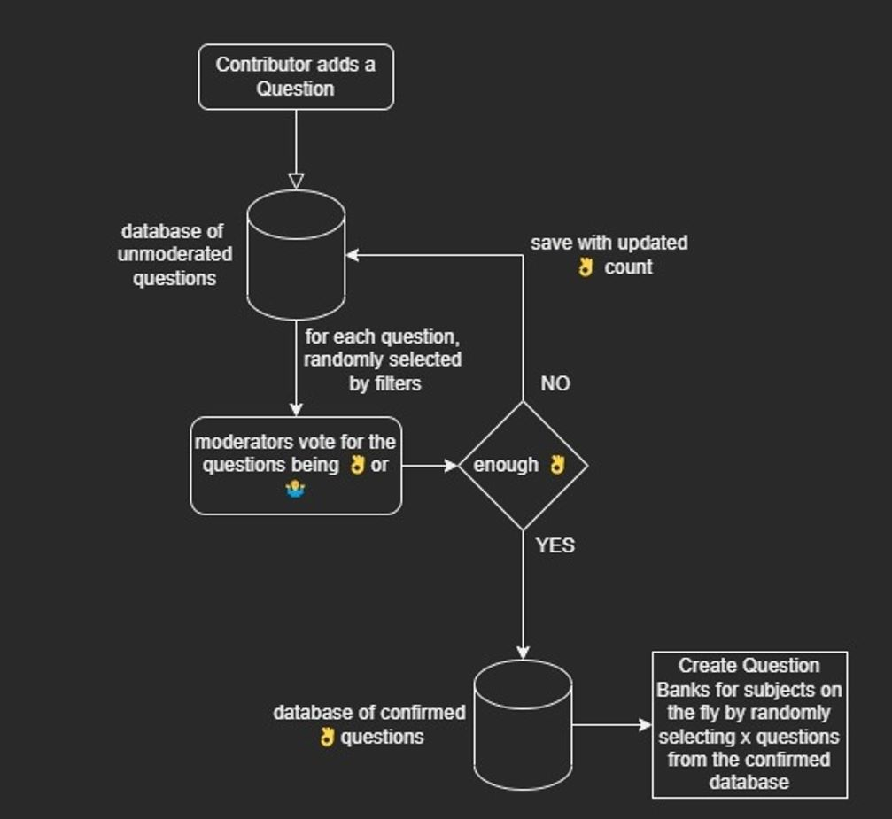

# crowd-source-question-bank

Flow Diagram

# use yarn!

1. `yarn` in the root directory

2. to run server
   `yarn workspace server start`

   to run client/react-app
   `yarn workspace client start`

   to run both server and client at the same time
   `yarn start`
